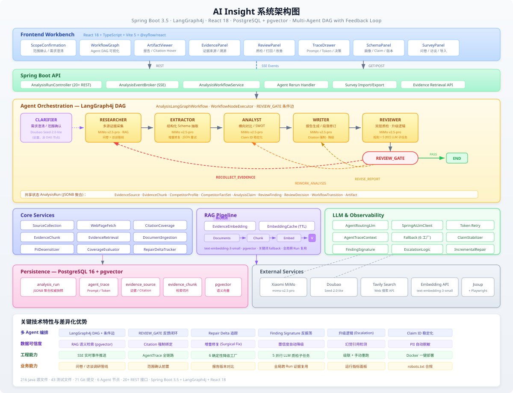

# AI Insight — 项目成果提交文档

---

## 一、基础信息

| 字段 | 内容 |
|------|------|
| 项目名称 | AI Insight — AI 驱动的竞品分析 Agent 协作系统 |
| 参赛课题 | CIS - AI 驱动的竞品分析 Agent 协作系统 |
| 团队名称 | <!-- TODO: 填写你的团队名称 --> |
| 队长 | <!-- TODO: 姓名 / 学校 / 专业 / 年级 --> |
| 队员 | <!-- TODO: 如有队员请补充，独立开发可写"独立完成" --> |

### 分工说明

| 成员 | 角色 | 负责模块 |
|------|------|----------|
| <!-- TODO --> | 架构师 / 全栈开发 | 系统架构设计、多 Agent 编排（LangGraph4j）、全部 Agent 节点开发、前端工作台、后端 API、数据库设计、Prompt 工程、部署运维 |

> 说明：本项目为独立完成，涵盖架构设计、前后端开发、Agent 编排、Prompt 工程、测试、文档和部署全流程。

---

## 二、功能说明

### 核心功能清单

1. **六角色 Agent 协作流水线**：Clarifier（范围确认）→ Researcher（信息采集）→ Extractor（知识抽取）→ Analyst（对比分析）→ Writer（报告撰写）→ Reviewer（质检复核），各 Agent 独立运行、结构化协作。
2. **结构化知识 Schema**：定义 `CompetitorProfile`（功能树、定价模型、用户画像）、`AnalysisClaim`（结论原子 + 置信度 + 证据 ID）、`ReviewDecision`（质检决策）等强类型对象，Agent 间通过结构化状态传递而非纯自然语言。
3. **Reviewer 驱动的反馈闭环**：Reviewer 同时执行确定性规则检查（引用覆盖、证据绑定、事实一致性）和 LLM 语义审查（5 路并行子任务），可生成结构化 `ReviewDecision` 打回 Researcher / Analyst / Writer，触发自动补采与下游重跑，并内置升级逻辑防止无限循环。
4. **全链路信息溯源**：每条 `AnalysisClaim` 绑定 `evidenceIds`，报告中的 `[S1]` `[S2]` citation 可 hover 查看来源摘要并跳转原始 URL；前端 EvidencePanel 和 citation hover 实现一键溯源。
5. **完整可观测性**：每个 Agent 的 Prompt、输入快照、输出摘要、原始模型输出、模型名称、Token 消耗、耗时、fallback 状态、异常信息全部记录在 `AgentTrace` 中，前端 TraceDrawer 支持可视化回放。
6. **问卷访谈调研管线**：Researcher 自动生成问卷草案和访谈提纲，支持导出腾讯问卷 DSL、导入 CSV/XLSX 调研数据，问卷结果转为结构化洞察进入证据链参与后续分析。

### 端到端使用流程

1. 用户在前端输入竞品分析需求（如"分析 Notion、飞书文档和 Confluence 在 AI 协作文档方向的竞品机会"），系统触发 Clarifier Agent 生成结构化范围确认草稿。
2. 用户在范围确认面板审核并修改竞品列表、分析维度、信息源偏好后点击确认，系统正式进入分析 DAG。
3. 用户可补充公开来源 URL 和内部资料（访谈摘要、问卷结果），系统将其沉淀为可引用的 `EvidenceSource`。
4. Researcher Agent 通过 Tavily 搜索 + 网页抓取 + RAG 向量检索收集多源证据，并生成问卷草案和访谈提纲。
5. Extractor Agent 从证据中按竞品逐个抽取结构化画像（功能树、定价、用户画像），Analyst Agent 生成横向对比矩阵、`AnalysisClaim` 和 SWOT 分析。
6. Writer Agent 将分析结果整合为带 citation 的结构化报告草稿。
7. Reviewer Agent 执行双层质检：规则验证器检查引用覆盖和证据绑定，LLM 语义审查检测过度推断和一致性问题；不合格时生成 `ReviewDecision` 打回对应 Agent 自动重跑。
8. 用户在前端三栏工作台查看完整报告，支持 citation 溯源跳转、Agent Trace 回放、单 Agent 手动重跑、报告版本对比和运行指标审查。

---

## 三、交付材料

| 材料类型 | 链接 / 说明 |
|----------|-------------|
| 在线 Demo | <!-- TODO: 填写 Demo 链接或录屏替代 --> |
| 演示视频 | <!-- TODO: 填写视频链接，建议 5-8 分钟 --> |
| 源代码仓库 | <!-- TODO: 填写 GitHub/GitLab 链接 --> |
| README | 见仓库根目录 `README.md`，含项目简介、依赖环境、启动步骤、目录结构、LLM 配置说明 |

> 演示视频建议覆盖：创建分析任务 → 范围确认 → 启动 DAG → Reviewer 打回补采 → 最终报告与 citation → Agent Trace 回放 → 单 Agent 重跑 → 问卷访谈模块。

---

## 四、技术说明

### 系统架构图

> 完整架构图请查看：[architecture-diagram-v2.svg](architecture-diagram-v2.svg)

### 核心技术栈

| 层级 | 技术选型 |
|------|----------|
| 前端 | React 18 + TypeScript + Vite 5 + @xyflow/react（DAG 可视化）+ react-markdown + rehype-raw + lucide-react |
| 后端 | Java 17 + Spring Boot 3.5 + Spring AI 1.1.3 + LangGraph4j 1.8.16 |
| 数据库 | PostgreSQL 16 + pgvector 扩展（JSONB 文档存储 + 向量语义检索 + 关系明细表） |
| 中间件 | Redis 7.4（可选，任务锁与事件缓存） |
| 大模型 | Xiaomi MiMo v2.5 Pro（主推理）+ Doubao Seed 2.0 Lite（Clarifier 路由）+ OpenAI Embedding（向量投影） |
| 搜索服务 | Tavily Search API（公开来源搜索）+ Jsoup（HTML 解析）+ Playwright（JS 渲染兜底） |
| 部署 | Docker Compose（PostgreSQL + Redis + App）+ 多阶段 Dockerfile（前端构建 → 后端构建 → JRE 运行时） |
| 可观测 | 自建 AgentTrace 系统，记录 Prompt、输入快照、输出摘要、原始模型输出、模型名、Token、耗时、fallback 状态 |
| 测试 | JUnit 5 + Mockito，43 个测试文件覆盖核心 Agent、Service、Workflow、Repository |

### 大模型 / AI 能力使用说明

**模型调用架构：**

项目通过 Spring AI 的 `OpenAiChatModel` 接入 OpenAI-compatible 接口，业务侧统一依赖 `LlmClient` 门面。`AgentRoutingLlmClient` 根据 Agent 角色路由到不同模型后端：Researcher、Extractor、Analyst、Writer、Reviewer 使用 Xiaomi MiMo v2.5 Pro（高质量推理），Clarifier 使用 Doubao Seed 2.0 Lite（轻量范围确认任务，降低成本）。

**关键 AI 能力：**

- **多 Agent LLM 编排**：LangGraph4j StateGraph 承载 6 个 Agent 节点 + REVIEW_GATE 条件边，每个 Agent 内部可发起多个并行 LLM 子任务（如 Reviewer 的 5 路并行语义审查），通过 `CompletableFuture` + `AgentTraceContext.wrap()` 实现 ThreadLocal 上下文跨线程传播。
- **RAG 证据检索**：`EvidenceEmbeddingService` 使用 OpenAI text-embedding-3-small 生成向量，存入 pgvector；`EvidenceRetrievalService` 支持语义相似度召回，未配置 embedding 时保留关键词 fallback；`EvidenceChunkService` 负责证据切片。
- **Deterministic Fallback**：每个 Agent 均实现确定性兜底工厂（如 `FallbackReportDraftFactory`、`FallbackReviewReportFactory`），LLM 不可用时仍可生成结构化输出，保证演示不中断。
- **增量修复（Incremental Repair）**：Extractor、Analyst、Writer 在 Reviewer 打回重做时只修改被 RepairTask 指向的部分，保留未受影响的分析内容，避免"修一处破全局"。
- **Token 感知重试**：当 LLM 因 token 截断输出时，`SpringAiLlmClient` 自动检测 finish_reason=LENGTH，以精简指令 + 增大 max_tokens 重试。
- **PII 脱敏**：`PiiDesensitizer` 在用户提供资料进入分析链路前自动检测和掩码个人身份信息。
- **Claim ID 稳定化**：Analyst 在重新生成 Claim 时通过内容匹配保留旧 ID，保证前端溯源链路不因重跑而断裂。
- **Finding Signature 追踪（反振荡）**：WorkflowNodeExecutor 记录 Reviewer Finding 签名，检测同一问题是否反复出现，持续未解决时自动升级到上游 Agent。

### 关键工程难点与解决方案

| 难点 | 解决方案 |
|------|----------|
| **LangGraph4j 在 Java 生态下的多 Agent 编排** | LangGraph4j 是 LangGraph 的 Java 移植，生态成熟度不如 Python 版。通过 `AnalysisLangGraphWorkflow` 封装 StateGraph 构建，`WorkflowNodeExecutor` 统一包装每个 Agent 节点的生命周期管理（状态追踪、Trace 创建、SSE 发布、取消检查、异常处理、Repair Delta 计算），解决 LangGraph4j 在条件边路由和状态传播上的不稳定问题。 |
| **Reviewer 反馈闭环的振荡与死循环风险** | 三层防护：1) `maxReviewReworkAttempts` 硬上限（默认 1-2 轮自动返工）；2) Finding Signature 追踪，检测同一问题是否在多轮反复出现；3) 升级逻辑——当 Analyst 层面的修复不能减少 Finding 时，自动升级到 Extractor 甚至 Researcher，从根源解决数据不足问题。 |
| **LLM 输出不稳定导致结构化抽取失败** | Extractor 的 JSON 修复重试机制：首次 LLM 输出 JSON 解析失败时，自动发起第二次 LLM 调用要求修复语法；`CompetitorProfileProjector` 从 `CompetitorFactSet` 重建 Profile，即使 LLM 输出结构有偏差也能保证 Schema 一致性。 |
| **增量修复 vs 全量重跑的权衡** | 引入 `ReviewRepairTask` 精确定位问题段落/字段，Extractor 按 section 保留未修改部分，Analyst 通过内容匹配保留 Claim ID，Writer 只修订 Reviewer 指向的段落。Repair Delta 追踪机制记录重跑前后的 metrics 变化（evidence count、claims、fingerprints），前端可展示"改了什么"。 |
| **PostgreSQL JSONB 大聚合体的读写性能** | `AnalysisRun` 作为单一 JSONB 聚合保存完整运行态，同时维护 `analysis_artifact`、`agent_step`、`agent_trace`、`evidence_source`、`evidence_chunk`、`review_finding` 六张明细表用于查询；保存时批量刷新明细表，读取时按需从聚合或明细表取数据。 |

### 部署与访问说明

1. 项目通过 Docker Compose 一键启动：`docker compose up -d` 启动 PostgreSQL + Redis，`mvn spring-boot:run` 启动后端，`cd frontend && npm run dev` 启动前端。
2. 后端默认端口 `http://localhost:8080`，前端默认端口 `http://localhost:5173`。
3. 评委可通过在线 Demo 链接直接访问，或观看演示视频了解完整流程。
4. 本地运行要求：JDK 17 + Maven 3.9+ + Node.js 18+ + Docker Desktop。
5. 未配置 LLM API Key 时系统自动使用 deterministic fallback，所有核心功能仍可演示。

---

## 五、结果说明

### 项目完成度

**当前状态：可用 Demo 版本**

系统已完成全部核心功能开发，支持端到端的竞品分析流程。216 个 Java 源文件、43 个测试文件、71 次 Git 提交记录。主要功能链路已打通并通过测试：

- 6 Agent 顺序协作 + Reviewer 反馈闭环 ✓
- Clarifier 前置范围确认 ✓
- LangGraph4j DAG 状态图编排 + REVIEW_GATE 条件边 ✓
- 结构化 Schema 状态传递 ✓
- Agent Trace 全量可观测 ✓
- PostgreSQL JSONB 持久化 ✓
- RAG 证据检索（embedding + pgvector） ✓
- 问卷访谈调研管线 ✓
- SSE 实时事件推送 ✓
- 单 Agent 手动重跑 ✓
- 前端三栏工作台 ✓
- Deterministic Fallback ✓

### 项目亮点 / 创新点

**亮点 1：增量修复 + 反振荡升级机制**

区别于常见的"QA 打回 → 全量重跑"模式，AI Insight 实现了外科手术式的增量修复：Reviewer 生成精确定位的 `ReviewRepairTask`，下游 Agent 只修改被指向的段落或字段，保留未受影响的分析内容。同时引入 Finding Signature 追踪检测振荡——当同一问题在修复后仍然出现时，系统自动将修复目标升级到上游 Agent（Analyst → Extractor → Researcher），从数据源头解决问题。

**亮点 2：六 Agent 结构化协作 + RAG 证据链**

系统不是简单的 LLM 链式调用，而是 6 个独立角色 Agent 通过强类型结构化对象（`ResearchPackage`、`CompetitorProfile`、`AnalysisClaim`、`ReviewDecision`）协作。结合 RAG 证据检索（embedding 向量 + pgvector + 关键词 fallback），每条分析结论都绑定可溯源的证据 ID，Reviewer 通过 `CitationCoverageEvaluator` 自动检测无引用结论和幻觉引用。

**亮点 3：问卷访谈调研管线 — 从被动搜索到主动调研**

在自动搜索公开信息之外，系统还具备主动调研能力：Researcher 自动生成问卷草案（可导出为腾讯问卷 DSL）和访谈提纲，支持 CSV/XLSX 调研数据导入，问卷结果经 LLM 精抽后转为结构化洞察进入证据链。这让竞品分析从"只能搜公开信息"升级为"可以主动做用户调研"。

---

## 六、选填补充材料

| 材料类别 | 材料名称 | 说明 / 链接 |
|----------|----------|-------------|
| 产品材料 | 项目讲解 PPT | <!-- TODO: 答辩用 Slides 链接 --> |
| 产品材料 | 产品截图 | <!-- TODO: 关键页面截图文件夹链接 --> |
| 技术材料 | API 接口文档 | 见仓库 README 中的 API 示例章节，20+ REST 接口 |
| 技术材料 | 数据库 ER 图 | 见 `docs/architecture.md`，核心为 `analysis_run` JSONB 聚合 + 6 张明细表 |
| AI 材料 | Prompt 策略文档 | 见仓库各 Agent 节点中的 system prompt 和 user prompt template |
| AI 材料 | 评测方案与样例 | 见 `docs/scoring-map.md`，含评分维度映射和演示证据 |
| 业务材料 | 场景落地设想 | 面向企业产品团队的竞品分析工作台，可扩展至行业研究、市场调研场景 |
| 过程材料 | 开发里程碑 | 71 次 Git 提交，3 周内独立完成架构设计到可用 Demo |

---

## 七、合规声明

合规确认：

- 信息采集遵守目标站点 robots.txt 与服务条款，`WebPageFetchService` 在抓取前检查 robots.txt 合规性，`EvidenceSource.complianceNote` 记录每次采集的合规状态（allowed / failed / blocked / fallback）。
- 用户提供资料中的敏感信息通过 `UserProvidedEvidence.sensitive` 标记，`PiiDesensitizer` 在资料进入分析链路前自动脱敏处理个人身份信息。
- 工具、模型、数据的使用符合公司及挑战赛"工具与资源使用规范"要求。
- API Key 通过 `.env` 本地维护，`.gitignore` 已排除，未提交任何真实密钥到代码仓库。
- 未使用任何受版权保护的非授权内容，所有分析数据均来自公开信息或用户主动提供。
